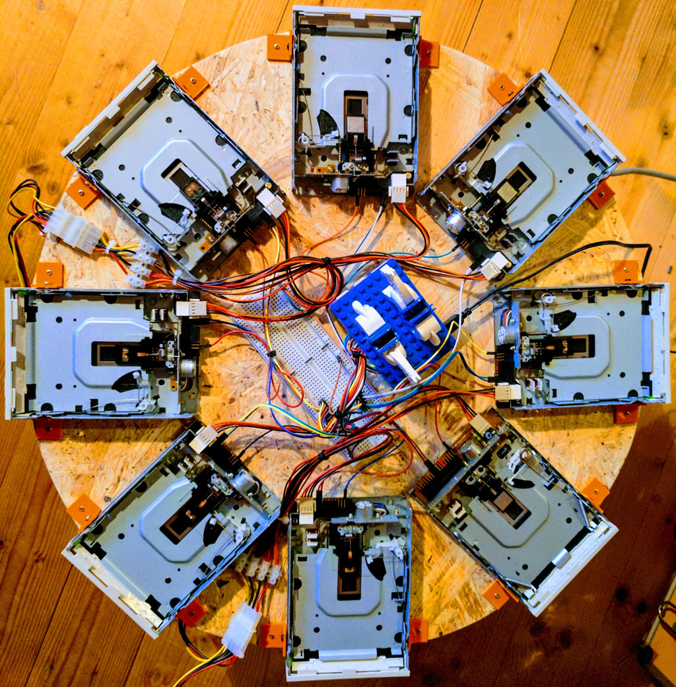

# Kernel Moppy

This is a fork of the great Moppy project from [SammyIAm](https://github.com/SammyIAm/Moppy). The goals of this fork a mainly:

* to provide a Linux Kernel module which allows driving floppies directly e.g. from a Raspberry Pi
* to provide a Python3 library which easily allows playing MIDI files through the floppies

This is work in progress and it is likely that things are changing a lot in future. Also documentation at the moment is very sparse.

Or to see a very early prototype in action see this [video](https://youtu.be/JAqpbqwstrw).

__Table of Contents__

<!-- TOC depthFrom:1 depthTo:6 withLinks:1 updateOnSave:1 orderedList:0 -->

- [Kernel Moppy](#kernel-moppy)
	- [Current state](#current-state)
	- [Things to do](#things-to-do)
	- [Hardware-Setup](#hardware-setup)
	- [Building and Installing the Raspberry Pi Kernel Module](#building-and-installing-the-raspberry-pi-kernel-module)
		- [Prerequisites](#prerequisites)
		- [Cross-Compile the Kernel and the Moppy Modules](#cross-compile-the-kernel-and-the-moppy-modules)
		- [Install the new Kernel on the Pi](#install-the-new-kernel-on-the-pi)
		- [Load the Moppy Kernel Module](#load-the-moppy-kernel-module)
		- [The Moppy sysfs Interface](#the-moppy-sysfs-interface)
			- [Stop and reset all Floppies](#stop-and-reset-all-floppies)
			- [Get Number of Channels](#get-number-of-channels)
			- [Play a Frequency](#play-a-frequency)
			- [Play a MIDI note](#play-a-midi-note)
	- [Install the Python Midi Players on the Pi](#install-the-python-midi-players-on-the-pi)
		- [Prerequisites](#prerequisites)
		- [Install the Players](#install-the-players)
	- [MoppyServer - Web-Based Player](#moppyserver-web-based-player)
	- [MoppyProxy - A Proxy to Classic Moppy](#moppyproxy-a-proxy-to-classic-moppy)
		- [Connecting MoppyDesk on the Pi (with Kernel Moppy)](#connecting-moppydesk-on-the-pi-with-kernel-moppy)
		- [Connecting MoppyDesk on remote to the Pi (with Kernel Moppy)](#connecting-moppydesk-on-remote-to-the-pi-with-kernel-moppy)
	- [MoppyPlayer - A Curses Based Player](#moppyplayer-a-curses-based-player)
		- [Play a MIDI File to Kernel Moppy](#play-a-midi-file-to-kernel-moppy)
		- [Play a MIDI File to Arduino](#play-a-midi-file-to-arduino)
		- [To play to real MIDI Device](#to-play-to-real-midi-device)

<!-- /TOC -->
## Current state

The following is currently in a more or less working state:

* Kernel Module to drive the floppies, currently only tested with a Raspberry Pi and eight floppy drives
* Python3 library for playing MIDI files
* Some Python3 tools like:
	* Curses based player
	* Web based player
	* Proxy to allow Java based MoppyDesk player to use Moppy Kernel module for
		playback
	* Special version of MoppyDesk which detects the proxy

## Things to do

* Write more documentation

## Hardware-Setup

For a Moppy Pi setup you will need the following hardware:

* 1 x Raspberry Pi 3 with Raspian on SD card (already configured to your needs)
* 1 to 8 3.5 floppy drives
* 1 power supply (e.g. old AT power supply, note that 8 drives need some juice)
* Jumper wires or the like

GND of all Floppies needs to be connected to GND of the Pi. All uneven numbered pins on the floppy connector are GND, thus just choose one of the pins from the bottom row of pins as GND.

Next, each floppy needs to have a jumper between pin 12 (6th pin of the upper row) and the pin below (GND).

Now, connect the step (ST) signal at pin 20 (10th pin form the upper row) and direction (DI) signal at pin 18 (9th pin from the upper row) from the floppies to the Pi header as shown below:

	Pin  GPIO  Sig.   Pin  GPIO  Sig.
	Pi   Pi    Floppy Pi   Pi    Floppy
	-----------------------------------
	 3   2     ST#0    5    3    DI#0
	11  17     ST#1   13   27    DI#1
	15  22     ST#2   16   23    DI#2
	19  10     ST#3   21    9    DI#3
	23  11     ST#4   24    8    DI#4
	29   5     ST#5   31    6    DI#5
	33  13     ST#6   35   19    DI#6
	37  26     ST#7   38   20    DI#7

    E.g. the first row from the table is to be read as follows:

        - connect ST (pin 20) from the first floppy to pin 3 (GPIO2) of the Pi
        - connect DI (pin 18) from the first floppy to pin 5 (GPIO3) of the Pi

* For flopy pin-out see [this](http://pinouts.ru/HD/InternalDisk_pinout.shtml)
* For Pi pin-out see [this](http://blog.mcmelectronics.com/post/Raspberry-Pi-3-GPIO-Pin-Layout)

## Building and Installing the Raspberry Pi Kernel Module

### Prerequisites

The build tools are 32 bit, thus make sure you have 32 bit libs installed
even when on a 64 bit Linux. For Ubuntu they are most likely already installed.
For Debian, the following commands would install them:

	sudo dpkg --add-architecture i386
	sudo apt-get update
	sudo apt-get install build-essential gcc-multilib rpm libstdc++6:i386 libgcc1:i386 zlib1g:i386 libncurses5:i386

### Cross-Compile the Kernel and the Moppy Modules

The Makefile will download the Pi Kernel sources from git, as well as the build tools.

On your host computer (not the Pi), first configure the environment to point to the right compiler:

	cd moppy-kmod
	source setenv.sh

Next, start the build:

	make

This will take a while, but at the end, the archive ``rpi-moppy-kernel.tar.bz2`` should have been created under the main directory.

### Install the new Kernel on the Pi

Copy the archive ``rpi-moppy-kernel.tar.bz2`` to your Pi. Now on the Pi execute the following command to install the new Kernel:

	sudo tar -jxvf todo -C /

You could ignore the complaints about file permissions (they are because the boot directory is on a FAT partition and tar is not able to set Linux permissions here). Next, reboot the Pi.

### Load the Moppy Kernel Module

Again on the Pi, load the Moppy module:

	modprobe moppy

You could get some information about the loading with:

	dmesg

### The Moppy sysfs Interface

Floppies could operated through the sysfs interface. The base path is:

    /sys/kernel/moppy

Note, that to access the kernel module via sysfs you must do so as user root,
or add the user pi to the group ``root``:

	sudo adduser pi root

#### Stop and reset all Floppies

    echo "reset" > /sys/kernel/moppy/ctrl

#### Get Number of Channels

Return a single line with: active_channels, freq_fact:

    cat /sys/kernel/moppy/info

#### Play a Frequency

To make floppy 0 play at 440Hz (note A):

    echo "0, 440" > /sys/kernel/moppy/freq

To stop floppy 0:

    echo "0, 0" > /sys/kernel/moppy/freq

#### Play a MIDI note

 Play MIDI note 69 / A4 to floppy 0:

    echo "0, 69" > /sys/kernel/moppy/note

Stop playing:

    echo "0, 0" > /sys/kernel/moppy/note

## Install the Python Midi Players on the Pi

### Prerequisites

Instal the Python3 dependencies:

    sudo apt-get install python3-pip
	sudo pip3 install Flask
	sudo pip3 install mido
	sudo pip3 install pyserial # if not already present

To access the kernel module via sysfs, the user pi needs to be added to the group ``root``:

	sudo adduser pi root

Please note, that the group settings apply after the next login only.

### Install the Players

From the host computer, copy the whole ``moppy-python`` directory (with all sub-directories) to the Pi.
On the Pi change into ``moppy-python/src`` and install like so:

    sudo python3 setup.py install

## MoppyServer - Web-Based Player

After installing the Python Midi players as described above, the ``MoppyServer`` could be started on the Pi with:

	moppy-server

Or, if you like to run it in the background

    moppy-server --logfile moppyserver.log &

With a browser, you now could access the player with the following URL:

	http://<ip-of-your-pi>:8088/

Via the web interface, upload MIDI files, delete MIDI files, play MIDI files.

## MoppyProxy - A Proxy to Classic Moppy

With the ``MoppyProxy`` various sezenarious are possible:

* Connect classic MoppyDesk to Kernel Moppy, both running on Pi
* Connect classic MoppyDesk on a remote machine to Kernel Moppy on Pi
* Connect classic MoppyDesk on a remote machine to Arduino Moppy on Pi

To use classic MoppyDesk, you need to have a JDK and Ant build tool installed. If unsure how to get this tools, have a look at [SDKMAN](http://sdkman.io/).

To compile MoppyDesk do the following on your host machine:

    cd moppy-desk
    ant

This should produce the JAR file ``dist/lib/MoppyDesk-combined-<DATE>.jar``. Copy this to your Pi. Please note, that the MoppyDesk version provided is a special version which detects the proxy if present. The version from SammyIAm will not work with the proxy.

### Connecting MoppyDesk on the Pi (with Kernel Moppy)

Start the proxy FIRST:

    moppy-proxy -r pty -w sysfs

Then SECOND start MoppyDesk on a different terminal:

    java -jar MoppyDesk-combined-<DATE>.jar

In the MoppyDesk application select for all channels "Moppy Serial" and set the value to "MOPPY PROXY". Now use MoppyDesk as usual.

### Connecting MoppyDesk on remote to the Pi (with Kernel Moppy)

For this, you need two proxy instances. One on the Pi and one on the Remote host. Both proxies are connected via network / UDP.

On the Pi:

    moppy-proxy -r udp -w sysfs --udphost <IP_OF_PI>

On the remote machine:

    moppy-proxy -r pty -w udp --udphost <IP_OF_PI>

And on a different terminal on the remote machine:

    java -jar MoppyDesk-combined-<DATE>.jar

Again, in the MoppyDesk application select for all channels "Moppy Serial" and set the value to "MOPPY PROXY". Now use MoppyDesk as usual.

## MoppyPlayer - A Curses Based Player

Mainly for testing, there is the curses based moppy player written in Python. You could use this player to play a MIDI file to kernel Moppy via sysfs or to an Arduino based setup via serial line. Also if you have real MIDI devices connected to your machine and installed ``rtmidi`` for Python, you could output to that device too.

### Play a MIDI File to Kernel Moppy

    moppy-player --optimize -f Tetris.mid

### Play a MIDI File to Arduino

    moppy-player --optimize -p serial --serdev /dev/ttyUSB0 -f Tetris.mid

### To play to real MIDI Device

First see which MIDI ports are available on your system:

    moppy-player -l

Now play to one of this ports by giving its full name:

    moppy-player --optimize -p MIDI_PORT_FULL_NAME -f Tetris.mid
